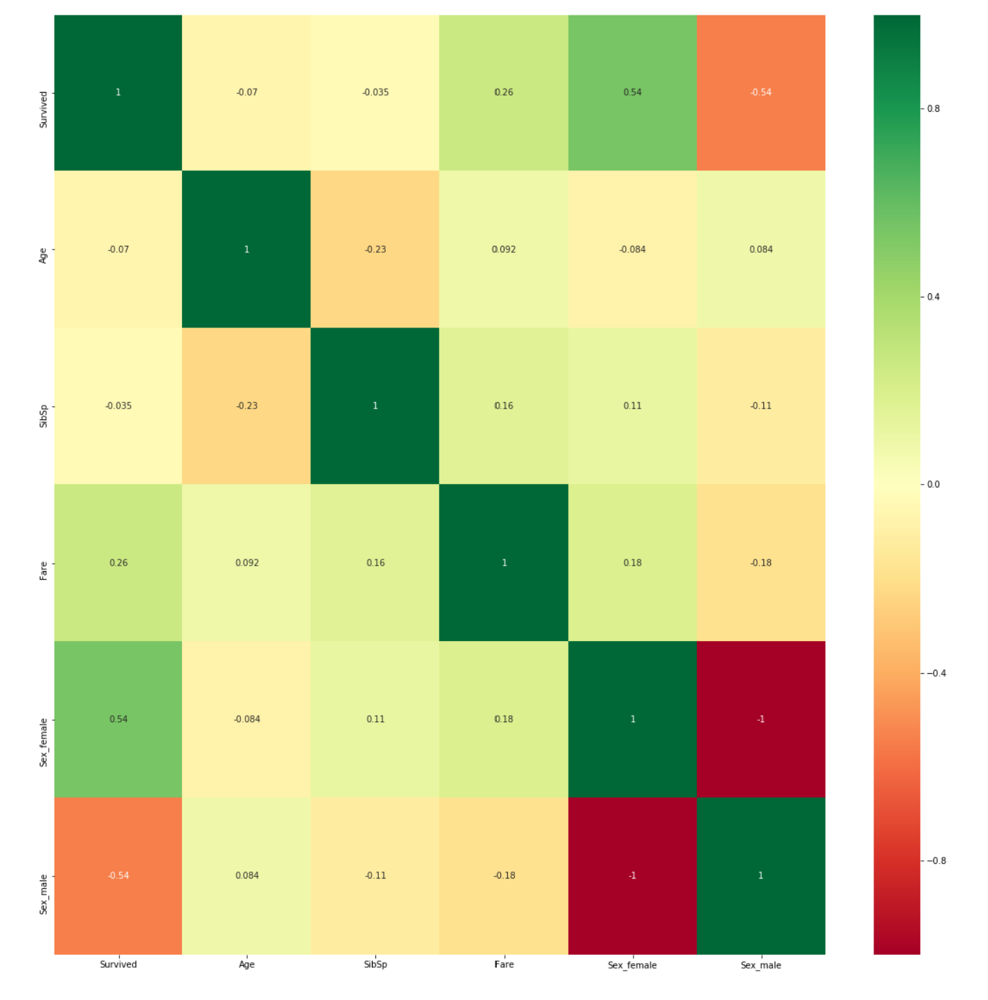
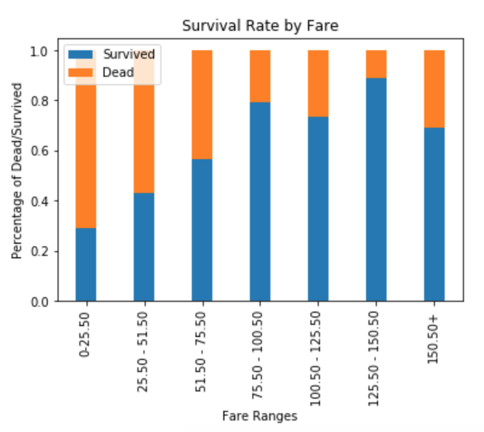
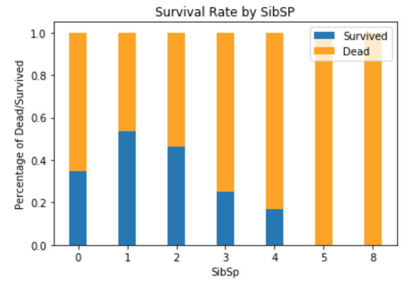
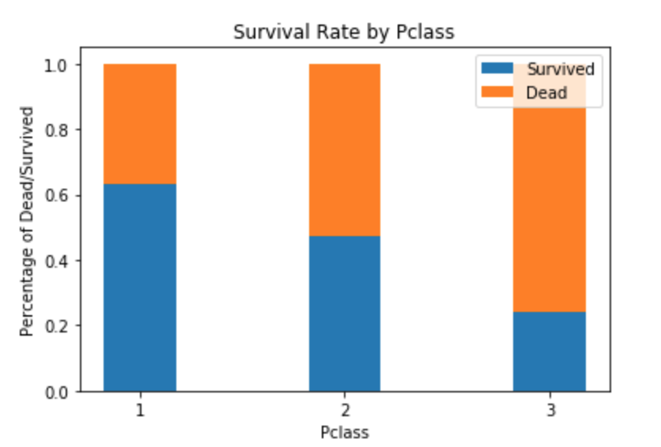
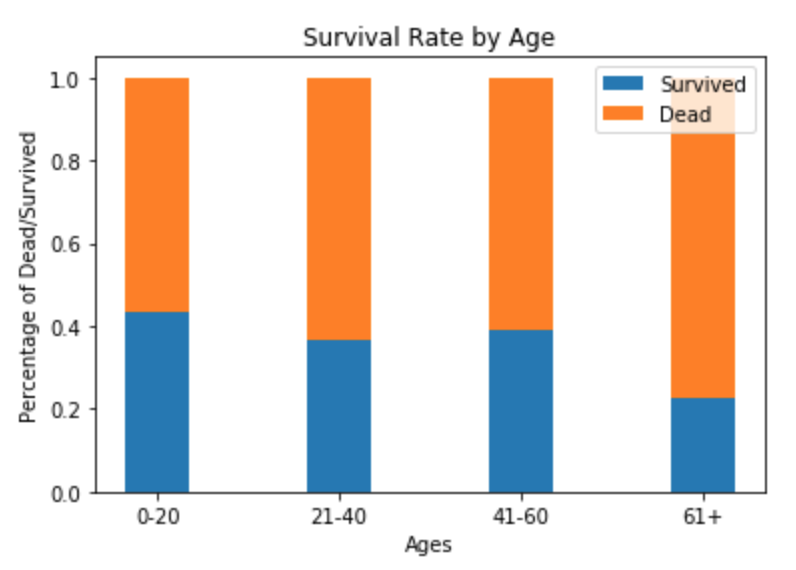
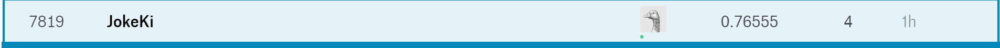

# Team Nomad Data Science
## Members
* Albert Eng
* Jose De La Rosa
* Joshua Kristanto

# Kaggle Titanic
* https://www.kaggle.com/c/titanic
* Train.csv and test.csv files originates from the link above.
# Charts

## Correlation Test
* After one-hot on Sex and dropping Names, Cabin, Embarked, Ticket, PassengerId, PClass, Parch
* 

## Surival Rate by Fare
* 

## Survival Rate by SibSP
* 

## Survival Rate by Pclass
* 

## Survival Rate by Age
* 

# Kaggle Score 
* 

# NSF support for the Data Science Program with Career Support and Connections to Industry Program, Award #1842386
* 
* 
